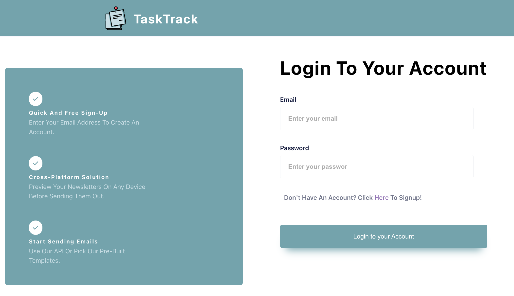
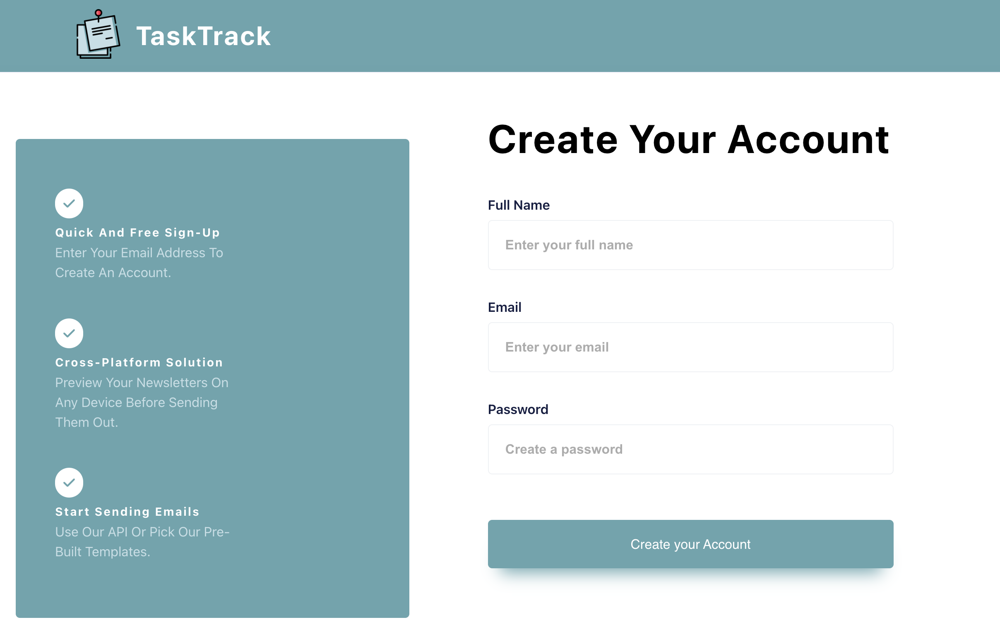
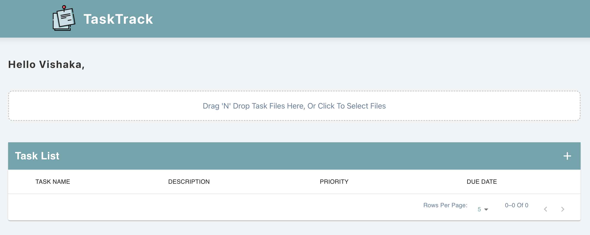
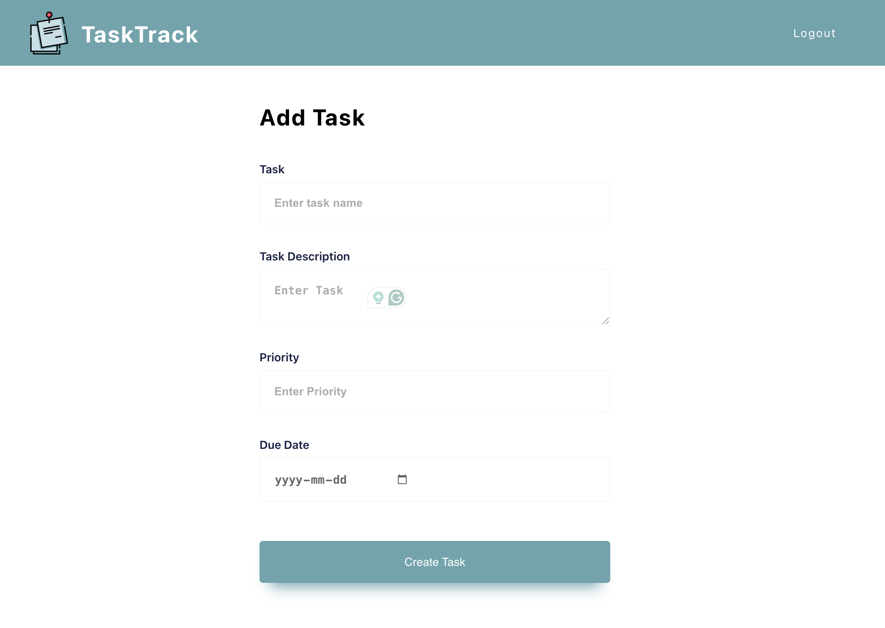
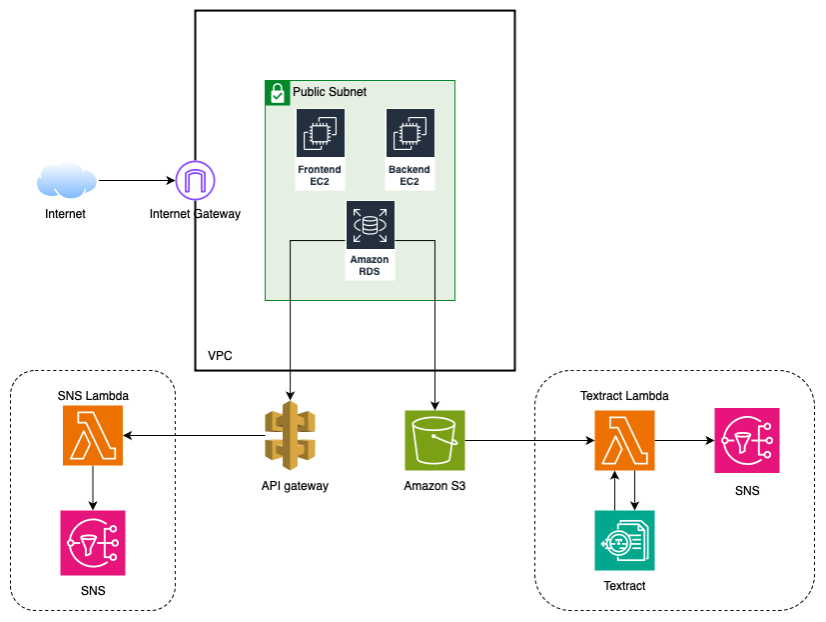

# TaskTrack

## Introduction

**TaskTrack** is a task tracking application aimed at helping young students manage their homework and assignments more effectively while improving communication between teachers and parents. The project leverages AWS cloud services to provide an efficient and scalable solution for tracking tasks and sending notifications.

## Objective

Growing up, I noticed that communication gaps between teachers, parents, and students often led to missed deadlines and incomplete homework. TaskTrack was designed to bridge that gap by empowering students to take responsibility for managing their homework and providing parents and teachers with timely updates. This project started with a basic version, but the plan is to progressively enhance the application’s functionality over time.

## Features

| **Feature**              | **Current Scope**                                               | **Future Scope**                                                 |
|--------------------------|-----------------------------------------------------------------|------------------------------------------------------------------|
| **Task Management**       | Allows users to add and delete tasks.                           | Teachers can add and delete homework and assignments.             |
| **Create New Task with File Upload** | Supports receiving tasks in PDF format and uploading files.    | Teachers can upload a PDF with assignment details that will be parsed and added to the task database. |
| **Task Dashboard**        | Provides a centralized view of all tasks.                      | Enhance with customizable widgets, advanced filtering, and sorting options. |
| **SNS Notifications**     | Users receive email notifications when tasks are added.        | Parents get notifications when a teacher adds tasks and reminders for upcoming due dates. |

## Technology Used

- **Frontend**: React.js
- **Backend API**: Spring Boot
- **Database**: Aurora MySQL (AWS RDS)
- **Hosting**: Amazon EC2
- **File Storage**: Amazon S3
- **Other Services**: AWS Lambda, Amazon Textract, Amazon SNS, AWS API Gateway, AWS CloudFormation

## Demo & Screenshots

### Login

### Signup

### Task Dashboard

### Add Task Form

[//]: # (### Project Demo)

[//]: # ([Watch the full project demo]&#40;./demo/ProjectDemo.mp4&#41;)

[//]: # ()
[//]: # (<video width="600" controls>)

[//]: # (  <source src="./demo/demo-video.mp4" type="video/mp4">)

[//]: # (  Your browser does not support the video tag.)

[//]: # (</video>)

## Performance Targets

- **Operational Excellence**: Supports development and operational workloads with monitoring capabilities via CloudWatch.
- **Security**: Uses MD5 hashing for password encryption and implements AWS Identity and Access Management (IAM).
- **Reliability**: Ensures responsive interaction for task management and navigation.
- **Performance Efficiency**: Optimizes resource use to meet evolving demands.
- **Cost Optimization**: Minimizes costs while maximizing business value.
- **Sustainability**: Focuses on sustainable resource utilization.

## Architecture

The architecture consists of a frontend UI hosted on an EC2 instance, backend APIs, and data storage in Aurora RDS. Users interact with the system via the task dashboard, where they can manage tasks and receive email notifications for task creation.

## Data Security

- **Aurora RDS**: User data is stored securely within a VPC, and IAM controls regulate database access.
- **Spring Boot**: Passwords are encrypted using MD5 hashing before being stored.
- **Additional Security**: Potential vulnerabilities can be mitigated with HTTPS communication and better session handling.

## Future Scope

- Introduce separate interfaces for teachers, students, and parents.
- Enhance the task tracking experience with real-time notifications and reminders.
- Integrate text extraction from handwritten submissions using AWS Textract.
- Improve accessibility by using Amazon Polly for text-to-speech functionality.

## References

1. [EC2 Storage over EBS](https://medium.com/@ayogun/i-chose-ec2-storage-over-ebs-despite-its-ephemeral-here-s-why-377f3280f5c2)
2. [AWS Lambda vs EC2](https://www.cbtnuggets.com/blog/certifications/cloud/aws-lambda-vs-ec2-which-to-use-and-when)
3. [Amazon RDS Features](https://aws.amazon.com/rds/features/)
4. [API Gateway Use Cases](https://docs.aws.amazon.com/apigateway/latest/developerguide/api-gateway-overview-developer-experience.html)
5. [What is Amazon Textract?](https://docs.aws.amazon.com/textract/latest/dg/what-is.html)
6. [Amazon Simple Notification Service](https://aws.amazon.com/sns/)

